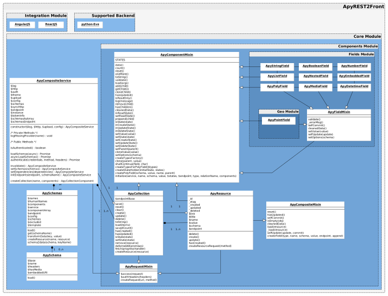

[](http://doge.mit-license.org)
[](https://gitlab.com/apysoft/apy-frontend/commits/master)

#### Gitlab
[](https://gitlab.com/apysoft/apy-frontend/builds)

#### Github
[](https://travis-ci.com/nam4dev/apy-rest2front)

# Apy REST2Front — Administrate your REST API instantly.

Apy REST2Front is a small project to automate frontend CRUD views application based on REST API schemas.
It tries to implement a generic data binding upon a REST API system to Web MMI.
Authentication is managed only for Oauth2 protocol, others shall be implemented

For now, only [`python-eve`][eve] REST API framework has been integrated.
For UI components (data representation & bindings), [`AngularJs`][angular] is used. 
Anyhow, `apy-rest2front` is intended to be plugged to any `UI` or `Backend` framework (**at worst, implement it :)**).

## Getting Started

To get you started you can simply clone the `apy-rest2front` repository and install the dependencies:

### Prerequisites

You need git to clone the `apy-rest2front` repository. You can get git from
[http://git-scm.com/](http://git-scm.com/).

We also use a number of node.js tools to initialize and test `apy-rest2front`. You must have node.js and
its package manager (npm) installed.  You can get them from [http://nodejs.org/](http://nodejs.org/).

### Clone `apy-rest2front`

Clone the `apy-rest2front` repository using [git][git]:

```
git clone https://gitlab.com/apysoft/apy-rest2front.git
cd apy-rest2front
```

If you just want to start a new project without the `apy-rest2front` commit history then you can do:

```bash
git clone --depth=1 https://gitlab.com/apysoft/apy-rest2front.git <your-project-name>
```

The `depth=1` tells git to only pull down one commit worth of historical data.

### Install Dependencies

We have two kinds of dependencies in this project: tools and `apy-rest2front` framework code.  The tools help
us manage and test the application.

* We get the tools we depend upon via `npm`, the [node package manager][npm].
* We get the `apy-rest2front` code via `bower`, a [client-side code package manager][bower].

We have preconfigured `npm` to automatically run `bower` so we can simply do:

```
npm install
```

Behind the scenes this will also call `bower install`.  You should find that you have two new
folders in your project.

* `node_modules` - contains the npm packages for the tools we need
* `app/bower_components` - contains the `apy-rest2front` framework files

*Note that the `bower_components` folder would normally be installed in the root folder but
`apy-rest2front` changes this location through the `.bowerrc` file.  Putting it in the app folder makes
it easier to serve the files by a webserver.*

## Get Configured

### Backend

#### Eve

In order to visualize `apy-rest2front` AngularJs implementation,
we shall ensure our backend has following settings enabled,
```python
    XML = False
    JSON = True
    # For dynamic backend' schemas to frontend mapping
    SCHEMA_ENDPOINT = 'your-schema-endpoint-name'
```
**If one cannot expose `schemas` endpoint,
see [Advanced Frontend Configuration](#toc15__anchor), specifically, [Static backend mapping](#toc18__anchor)**

To ensure user experience of Media document(s) visualisation,

```python
    RETURN_MEDIA_AS_BASE64_STRING = False
    RETURN_MEDIA_AS_URL = True
    EXTENDED_MEDIA_INFO = ['content_type', 'name']
```

### Frontend

#### AngularJs

Simply open ``apy-rest2front/integration/angular/app.js`` file.

**And edit lines**,


```javascript
    var config = {
        //...
        endpoint: 'http://localhost:5000/',
        schemasEndpointName: 'your-schema-endpoint-name',
        //...
        // If Eve logs endpoint is enabled
        excludedEndpointByNames: ['logs'],
        //...
    };
```

## Build

Build is preconfigured with a simple command.  Simply run:

```
npm run build
```

**Several folders are created during this process**

```
build/          Root directory
  app/          Apy REST2Front minified application (configured with appropriated settings)
  docs/         Apy REST2Front documentation
  coverage/     Apy REST2Front coverage (open ./coverage/index.html)
```

## Run the Build

### Application

We have preconfigured the project with a simple development web server.  The simplest way to start
this server is:

```
npm start
```

**We need to ensure `Eve REST API` is running on our configured `endpoint`**

Now browse to the app folder at [`http://localhost:9000/build/app`](http://localhost:9000/build/app).


### Coverage

Simply browse to the coverage folder at [`http://localhost:9000/build/coverage`](http://localhost:9000/build/coverage).

**Then select the desired browser folder (eg. `PhantomJS 2.1.1 (Linux 0.0.0)/`)**

### Documentation

Simply browse to the docs folder at [`http://localhost:9000/build/docs`](http://localhost:9000/build/docs).

`Enjoy :)`

## Advanced Configuration

This section describes how to tweak Apy REST2Front behavior based on settings.

### Authentication

#### Oauth2

Simply open ``apy-rest2front/integration/angular/app.js`` file.

**And edit lines**,

```javascript
    var config = {
        //...
        endpoint: 'http://localhost:5000/',
        schemasEndpointName: 'your-schema-endpoint-name',
        auth: {
            enabled: true,
            grant_type: 'password', // OAUTH2 GRANT TYPE
            endpoint: 'http://localhost:5000/oauth2', // OAUTH2 ENDPOINT
            client_id: '0123456789yljgk98765432101kFEAHAAAH' // OAUTH2 CLIENT ID
        }
        //...
        // If Eve logs endpoint is enabled
        excludedEndpointByNames: ['logs'],
        //...
    };
```

**For backend authentication, refer to appropriated documentation**

- **[Eve REST API Python framework - Authentication][eve-auth]**

### Static backend mapping

``Apy REST2Front`` allow one to specify a static snapshot of its Endpoints definition (JSON) into settings (see below example).

***This is usually done when schemas endpoint cannot be enabled***

**Important** One assumes those exact settings are present in the backend (DOMAIN) as follow

**Endpoints definition example**

* backend, [Eve REST API Python framework][eve]

```python
# settings.py

POST = {
    'item_title': "Post",
    'schema': {
        'description': {
            'type': "string"
        },
        'title': {
            'type': "string"
        }
    }
}

MEMBER = {
    'item_title': "Member",
    'schema': {
        'posts':{
            'type': "list",
            'schema': {
                'type': "objectid",
                'data_relation': {
                    'resource': "posts",
                    'embeddable': True
                }
            }
        },
        'email': {
            'type': "string"
        },
        'firstName': {
            'type': "string"
        },
        'lastName': {
            'type': "string"
        },
        'location': {
            'type': "dict",
            'schema': {
                'entered_date': {
                    'required': True,
                    'type': "datetime"
                },
                'details': {
                    'type': "dict",
                    'schema': {
                        'city': {
                            'required': True,
                            'type': "string"
                        },
                        'zip_code': {
                            'required': True,
                            'type': "integer"
                        },
                        'state': {
                            'type': "string"
                        },
                        'address': {
                            'required': True,
                            'type': "string"
                        },
                        'address_complement': {
                            'type': "string"
                        }
                    }
                }
            }
        }
    }
}

# ...

DOMAIN = {
    'posts': POST,
    'members': MEMBER
}
```

* frontend, [AngularJS][angular]

```javascript
// AngularJS Integration example
// apy-rest2front/integration/angular/app.js

//...

// Member's Post endpoint schema
var post = {
    item_title: "Post",
    schema: {
        description: {
            type: "string"
        },
        title: {
            type: "string"
        }
    }
};

// Member endpoint schema (aka User)
var user = {
    item_title: "Member",
    schema: {
        posts:{
            type: "list",
            schema: {
                type: "objectid",
                data_relation: {
                    resource: "posts",
                    embeddable: true
                }
            }
        },
        email: {
            type: "string"
        },
        firstName: {
            type: "string"
        },
        lastName: {
            type: "string"
        },
        location: {
            type: "dict",
            schema: {
                entered_date: {
                    required: true,
                    type: "datetime"
                },
                details: {
                    type: "dict",
                    schema: {
                        city: {
                            required: true,
                            type: "string"
                        },
                        zip_code: {
                            required: true,
                            type: "integer"
                        },
                        state: {
                            type: "string"
                        },
                        address: {
                            required: true,
                            type: "string"
                        },
                        address_complement: {
                            type: "string"
                        }
                    }
                }
            }
        }
    }
};

//...

var config = {
    //...
    schemas: {
        posts: post,
        members: user
    }
    //...
};

application.provider("apy", function apyProvider () {
    this.$get = function apyFactory () {
        //...
        return new $apy.CompositeService($http, Upload, config);
    };
});
```

#### Overriding backend's endpoint(s)

``Apy REST2Front`` allow one to override a backend's endpoint when this one does not define a schema for a particular `Resource`.

To get a better understanding see below example :)

**Endpoints definition Override example**

* backend, [Eve REST API Python framework][eve]

```python
# settings.py

SCHEMA_LESS_LIST = {
    'schema': {
        'lists': {
            # Eve/Mongo allows schema-less Resource
            'type': 'list'
        }
    }
}

# ...

DOMAIN = {
    'Lists': SCHEMA_LESS_LIST
}
```

* frontend, [AngularJS][angular]

```javascript
// AngularJS Integration example
// apy-rest2front/integration/angular/app.js

// endpoint schema override
var lists = {
    item_title: "Interesting Events List",
    schema: {
        lists: {
            type: 'list',
            schema: {
                type: "datetime",
                default: function() {
                    return new Date();
                }
            }
        }
    }
};

//...

var config = {
    //...
    schemas: {
        Lists: lists
    }
};

application.provider("apy", function apyProvider () {
    this.$get = function apyFactory () {
        //...
        return new $apy.CompositeService($http, Upload, config);
    };
});
```

## Testing

There are two kinds of tests in the `apy-rest2front` application: Unit tests and End to End tests.

### Running Unit Tests

The `apy-rest2front` app comes preconfigured with unit tests. These are written in
[Jasmine][jasmine], which we run with the [Karma Test Runner][karma]. We provide a Karma
configuration file to run them.

* the configuration is found at `karma.conf.js`
* the unit tests are found into `apy-rest2front/tests` folder and are named as `test_*.js`.

The easiest way to run the unit tests is to use the supplied npm script:

```
npm test-with-watcher (dev mode through karma)
```

This script will start the Karma test runner to execute the unit tests. Moreover, Karma will sit and
watch the source and test files for changes and then re-run the tests whenever any of them change.
This is the recommended strategy; if your unit tests are being run every time you save a file then
you receive instant feedback on any changes that break the expected code functionality.

You can also ask Karma to do a single run of the tests and then exit.  This is useful if you want to
check that a particular version of the code is operating as expected.  The project contains a
predefined script to do this:

```
npm run test (single run through gulp & karma)
```


### End to end testing

The `apy-rest2front` app comes with end-to-end tests, again written in [Jasmine][jasmine]. These tests
are run with the [Protractor][protractor] End-to-End test runner.  It uses native events and has
special features for Angular-based applications.

* the configuration is found at `e2e-tests/protractor-conf.js`
* the end-to-end tests are found in `e2e-tests/scenarios.js`

Protractor simulates interaction with our web app and verifies that the application responds
correctly. Therefore, our web server needs to be serving up the application, so that Protractor
can interact with it.

```
npm start
```

In addition, since Protractor is built upon WebDriver we need to install this.  The `apy-rest2front`
project comes with a predefined script to do this:

```
npm run update-webdriver
```

This will download and install the latest version of the stand-alone WebDriver tool.

Once you have ensured that the development web server hosting our application is up and running
and WebDriver is updated, you can run the end-to-end tests using the supplied npm script:

```
npm run protractor
```

This script will execute the end-to-end tests against the application being hosted on the
development server.

**Note that very few e2e tests have been made**


## Updating Apy REST2Front

Previously we recommended that you merge in changes to `apy-rest2front` into your own fork of the project.
Now that the `apy-rest2front` framework library code and tools are acquired through package managers (npm and
bower) you can use these tools instead to update the dependencies.

You can update the tool dependencies by running:

```
npm update
```

This will find the latest versions that match the version ranges specified in the `package.json` file.

You can update the `apy-rest2front` dependencies by running:

```
bower update
```

This will find the latest versions that match the version ranges specified in the `bower.json` file.


## Serving the Application Files

While `apy-rest2front` is client-side-only technology, we recommend serving the project files using a local
webserver during development to avoid issues with security restrictions (sandbox) in browsers. The
sandbox implementation varies between browsers, but quite often prevents things like cookies, xhr,
etc to function properly when an html page is opened via `file://` scheme instead of `http://`.


### Running the App during Development

The `apy-rest2front` project comes preconfigured with a local development webserver.  It is a node.js
tool called [http-server][http-server].  You can start this webserver with `npm start` but you may choose to
install the tool globally:

```
sudo npm install -g http-server
```

Then you can start your own development web server to serve static files from a folder by
running:

```
http-server -a localhost -p 8000
```

Alternatively, you can choose to configure your own webserver, such as apache or nginx. Just
configure your server to serve the files under the `app/` directory.

## Design

### Classes Diagram


[Apy REST2Front UML Classes diagram](./design/UML_classes_diagram.png)

### Directory Layout

```
app/
  index.dev.html                  --> Angular integration development template
  index.html                      --> Angular integration production template (cannot be used as is - need Gulp)
  apy-rest2front/                 --> Apy REST2Front library
    core/                         --> Apy REST2Front Core (fields, ...)
      errors/                     --> Apy REST2Front Errors (`apy`, `python-eve`, ...)
        bases.js                  --> Apy REST2Front Error bases
        eve.js                    --> Apy REST2Front `python-eve` Error classes
      components/                 --> Apy REST2Front Components (Collection, Resource, Field, ...)
        base.js                   --> Apy REST2Front Base abstraction (ComponentMixin)
        mixins.js                 --> Apy REST2Front Mixins (RequestMixin, CompositeMixin)
        schemas.js                --> Apy REST2Front Schemas management abstraction
        resource.js               --> Apy REST2Front Resource Component
        collection.js             --> Apy REST2Front Collection Component
        fields/                   --> Apy REST2Front fields (string, number, media, ...)
          geo/                    --> Apy REST2Front Geo fields (Point, Polygon, Line, ...)
            point.js              --> Apy REST2Front Geo Point Component
          field.js                --> Apy REST2Front Field abstraction (FieldMixin)
          poly.js                 --> Apy REST2Front PolyMorph field Component
          list.js                 --> Apy REST2Front List field Component
          boolean.js              --> Apy REST2Front Boolean field Component
          string.js               --> Apy REST2Front String field Component
          datetime.js             --> Apy REST2Front Datetime field Component
          nested.js               --> Apy REST2Front Nested (dict) field Component
          embedded.js             --> Apy REST2Front Object ID (Embedded Resource) field Component
          media.js                --> Apy REST2Front Media field Component (any type of Resource, file, picture, music, ...)
          number.js               --> Apy REST2Front Number field Component (groups Integer, Float & Number types)
      core.js                     --> Apy REST2Front Core Service
      helpers.js                  --> Apy REST2Front helpers
      namespaces.js               --> Apy REST2Front namespace definitions (apy, components, fields, helpers, ...)
    integration/                  --> Groups all available UI frameworks (AngularJS)
      angular/                    --> AngularJS UI integration
        app.js                    --> AngularJS Controller/Settings definition
        services.js               --> AngularJS Services (ApyModalProvider, ApyProvider, ...)
        login.css                 --> AngularJS Login view CSS rules (when authentication is enabled)
        login.html                --> AngularJS Login view HTML representation (when authentication is enabled)
        view.html                 --> AngularJS field views HTML representation
        view.js                   --> AngularJS field views abstraction
        directives/               --> AngularJS directives
          field.js                --> Apy REST2Front generic directive to display any `apy.components.fields`
          version/                --> Directive to display current Project version
            version.js            --> ...
            ...
      common/                     --> Apy REST2Front Common integration UI components
        css/                      --> Apy REST2Front common CSS rules
          core.css                --> Apy REST2Front Core CSS rules
          responsive.css          --> Apy REST2Front Responsive CSS rules
        favicon.ico               --> Apy REST2Front favicon
```

## Contact

For more information, please check out [Apy REST2Front][apy-rest2front]

[eve]: http://python-eve.org/
[eve-auth]: http://python-eve.org/authentication.html
[angular]: https://angularjs.org/
[AngularJS]: https://angularjs.org/
[react]: https://facebook.github.io/react/
[dj-rest-fwk]: http://www.django-rest-framework.org/
[apy-rest2front]: https://gitlab.com/apysoft/apy-rest2front
[git]: http://git-scm.com/
[bower]: http://bower.io
[npm]: https://www.npmjs.org/
[node]: http://nodejs.org
[protractor]: https://github.com/angular/protractor
[jasmine]: http://jasmine.github.io
[karma]: http://karma-runner.github.io
[http-server]: https://github.com/nodeapps/http-server
